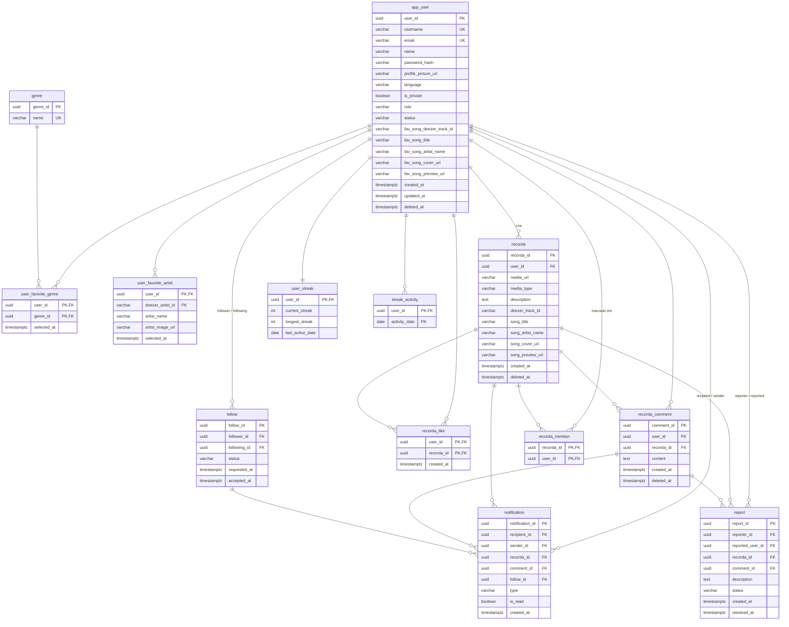

# Recorda — Modelo de Dados v3.0 (MVP)

**Status:** Decisões fechadas pelo sênior com adaptações técnicas consolidadas no backend (alinhado ao [ADR 0001](../adr/0001-alinhamento-ao-diagrama-do-banco.md)). Este documento substitui a v2.0 e serve de referência canônica para os models SQLAlchemy, schemas Pydantic e migrations Alembic.

**Escopo.** Isto é um **MVP / POC**. O modelo cobre exatamente o que foi decidido — nada além. Tudo que não foi decidido está **fora do escopo** (ver Parte 7) e pode ser adicionado numa iteração futura sem quebrar o que existe: quase tudo seria coluna ou tabela nova, não migração destrutiva.

**Plataforma & Autenticação.** PostgreSQL (gerenciado via Docker/produção) com SQLAlchemy e Alembic, mantendo compatibilidade com SQLite para a suíte de testes unitários. A autenticação utiliza **JWT próprio + hash de senha via PBKDF2** (com desvio consciente em relação a provedores externos de auth, conforme documentado no ADR 0001).

> **Convenções (decisões técnicas fechadas)**
> - Nomes de tabela/coluna em `snake_case`. Os que colidiam com palavras reservadas viraram `app_user`, `recorda_like`, `recorda_comment` (D66).
> - Toda PK e FK é `UUID`. No backend, são geradas na aplicação (`uuid.uuid4()`) para compatibilidade com SQLite nos testes, e com `DEFAULT gen_random_uuid()` nas migrations PostgreSQL (D65).
> - Toda coluna temporal é `TIMESTAMPTZ` (D68). O "dia" do streak é calculado no backend com fuso **fixo `America/Sao_Paulo`** (D41).
> - Enums são `VARCHAR` + `CHECK` (D67).
> - **Soft delete** com `deleted_at`. Nunca há `DELETE` físico de conteúdo principal. Toda leitura (feed, perfil, busca, contagens) filtra `deleted_at IS NULL` — filtro simples no backend, sem views (D71).
> - Provedor de música único: **Deezer**. O app **nunca** consulta a API do Deezer para renderizar — os dados da música ficam gravados (snapshot) no banco (D1, D9, D11).
> - Migrações versionadas via **Alembic** (`alembic/`) (D69).

---

## Parte 0 — O que mudou da v2.0 para a v3.0

**Tabelas removidas (5) — de 18 para 13**

| Tabela | Motivo |
|---|---|
| `ARTIST`, `SONG`, `SONG_ARTIST` | Substituídas por **snapshot** da música direto no `recorda` (D1). Sem catálogo local, sem importação/deduplicação. |
| `ARTIST_GENRE` | Explorar cruza gênero e artista como **sinais independentes**; não há vínculo artista→gênero (D2, D6). |
| `USER_FAVORITE_SONG` | Vira colunas `fav_song_*` em `app_user` (relação 1:1) (D15). |

**Renomeações físicas** (D66): `USER` → `app_user` · `LIKE` → `recorda_like` · `COMMENT` → `recorda_comment`.

**Colunas novas & Ajustes de Aplicação**

| Tabela | Coluna | Decisão / Motivo |
|---|---|---|
| `app_user` | `name` | Obrigatório no cadastro conforme requisito de produto (ADR 0001). |
| `app_user` | `password_hash` | Hash de senha PBKDF2 para autenticação via JWT próprio (ADR 0001). |
| `app_user` | `status` (`ACTIVE` / `SUSPENDED`) | D57 |
| `app_user` | `fav_song_deezer_track_id`, `fav_song_title`, `fav_song_artist_name`, `fav_song_cover_url`, `fav_song_preview_url` | D15 (anuláveis na criação, preenchidos no onboarding — ADR 0001). |
| `recorda` | `deezer_track_id`, `song_title`, `song_artist_name`, `song_cover_url`, `song_preview_url` | D1, D5 (`song_cover_url` aceita `''` se a faixa não tiver capa — ADR 0001). |
| `recorda_comment` | `deleted_at` | D52 |
| `notification` | `comment_id`, `follow_id` (FK opcionais) | D47 |
| `user_favorite_artist` | `deezer_artist_id`, `artist_name`, `artist_image_url` | D19 (snapshot; sem FK para tabela de artista). |

**Simplificações**

- `report.status` passa de 4 para **3** valores (`OPEN`, `RESOLVED`, `DISMISSED`) — sem `UNDER_REVIEW`.
- `report` **não** tem coluna de motivo estruturado; só `description` livre e opcional (D51).
- Sem `MODERATION_ACTION`, sem papel `MODERATOR`, sem tabela `BLOCK` (D55, D54, D37).
- `recorda_mention` **não** tem status de aprovação (D24).

---

## Parte 1 — Princípios do MVP

1. **Snapshot-first.** A busca de música/artista acontece no cliente, contra o Deezer, no momento da escolha. O que interessa (`deezer_track_id`, título, artista principal, capa, preview) é **copiado** para o banco. Não há refresh: o dado é estático (D9). Se a busca ao Deezer falhar na criação de um Recorda, a criação é **bloqueada** — todo Recorda nasce com música resolvida (D10).
2. **Privacidade vive no perfil, nunca no post.** `app_user.is_private` decide tudo. Não existe visibilidade por Recorda.
3. **Soft delete universal.** Excluir conta, Recorda ou comentário = preencher `deleted_at`. A moderação usa o mesmo mecanismo (D56). Integridade referencial preservada; o backend filtra.
4. **Recorda é imutável.** Criado, não se edita (sem `updated_at`). Só se exclui (D27). Comentário idem.
5. **Regras "quantitativas" são da aplicação, não do banco.** Mínimos do onboarding (1 música, ≥1 gênero, ≥3 artistas), máximos visuais (~5 gêneros, ~10 artistas), limite de marcações (~10) — tudo validado no app (D16, D17, D22).
6. **Cache derivado explícito.** `user_streak` é um placar recalculável a partir de `streak_activity`, que é a fonte da verdade.
7. **O que não está neste documento está fora do escopo do MVP** (Parte 7).

---

## Parte 2 — As 13 Tabelas

### 1. `app_user`

Conta + perfil + preferências 1:1 do onboarding. A tabela mais referenciada do modelo.

| Coluna | Tipo | Chave | Nulo | Descrição |
|---|---|---|---|---|
| user_id | UUID | PK | Não | gerado via `uuid.uuid4()` (compatível com SQLite e PostgreSQL) |
| username | VARCHAR | UNIQUE | Não | `@` público |
| email | VARCHAR | UNIQUE | Não | e-mail para autenticação JWT e contato |
| name | VARCHAR | — | Não | nome de exibição do usuário (ADR 0001) |
| password_hash | VARCHAR | — | Sim | hash da senha com PBKDF2 (autenticação JWT própria — ADR 0001) |
| profile_picture_url | VARCHAR | — | Sim | foto de perfil |
| language | VARCHAR | — | Não | ex.: `pt-BR` (default `pt-BR`) |
| is_private | BOOLEAN | — | Não | default `false`; `true` = follow precisa de aprovação |
| role | VARCHAR | — | Não | `CHECK IN ('USER','ADMIN')`, default `USER` |
| status | VARCHAR | — | Não | `CHECK IN ('ACTIVE','SUSPENDED')`, default `ACTIVE` |
| fav_song_deezer_track_id | VARCHAR | — | Sim | música preferida — snapshot (preenchido no onboarding) |
| fav_song_title | VARCHAR | — | Sim | " |
| fav_song_artist_name | VARCHAR | — | Sim | artista principal |
| fav_song_cover_url | VARCHAR | — | Sim | capa (aceita `''` quando ausente — ADR 0001) |
| fav_song_preview_url | VARCHAR | — | Sim | prévia de áudio, quando o Deezer fornece |
| created_at | TIMESTAMPTZ | — | Não | criação da conta |
| updated_at | TIMESTAMPTZ | — | Não | última alteração do perfil |
| deleted_at | TIMESTAMPTZ | — | Sim | soft delete: nulo = conta ativa |

**Chaves & constraints.** PK `user_id`. `UNIQUE (username)`, `UNIQUE (email)`.

**Regras (MVP)**
- O usuário é registrado com `username`, `email`, `name` e senha (`password_hash`). Os campos `fav_song_*` são anuláveis na criação e preenchidos no onboarding obrigatório (D13, D16). O indicador `onboarding_completed` é derivado na aplicação (`fav_song_deezer_track_id IS NOT NULL`). Trocar a música preferida é `UPDATE` direto nessas colunas, sem histórico (D14).
- `role = 'ADMIN'` é atribuído via banco ou script de seed de administração (D53).
- `status = 'SUSPENDED'` bloqueia o login e geração de tokens JWT. A moderação seta esse valor (D56, D57).
- Sem `bio`. Sem colunas de anonimização/LGPD (D58, D59).
- Autenticação gerenciada internamente com tokens JWT e validação de permissões nas rotas da API.

**Deleção.** Soft delete. O backend filtra `deleted_at IS NULL` em login, busca, feed, listas de seguidores e sugestões (D34).

---

### 2. `follow`

Uma linha por relação direcionada "A segue B".

| Coluna | Tipo | Chave | Nulo | Descrição |
|---|---|---|---|---|
| follow_id | UUID | PK | Não | |
| follower_id | UUID | FK → app_user | Não | quem segue |
| following_id | UUID | FK → app_user | Não | quem é seguido |
| status | VARCHAR | — | Não | `CHECK IN ('PENDING','ACCEPTED')` |
| requested_at | TIMESTAMPTZ | — | Não | quando foi solicitado |
| accepted_at | TIMESTAMPTZ | — | Sim | quando foi aceito (nulo enquanto pendente) |

**Chaves & constraints.** PK `follow_id`. `UNIQUE (follower_id, following_id)`. `CHECK (follower_id <> following_id)`.

**Regras (MVP)**
- Perfil público → a linha nasce `ACCEPTED`. Privado → nasce `PENDING`; só `ACCEPTED` dá acesso aos Recordas.
- Privado → público: `UPDATE` em lote `PENDING → ACCEPTED` (preenchendo `accepted_at`), em uma transação (D35).
- Público → privado: quem já seguia permanece `ACCEPTED`; só novos pedidos entram como `PENDING` (D36).

**Deleção.** `ON DELETE CASCADE` a partir de `app_user`. Como contas são soft-deleted, na prática as linhas ficam e o backend as filtra pelas contas ativas.

---

### 3. `genre`

Vocabulário controlado de gêneros, definido pelo próprio sistema.

| Coluna | Tipo | Chave | Nulo | Descrição |
|---|---|---|---|---|
| genre_id | UUID | PK | Não | |
| name | VARCHAR | UNIQUE | Não | ex.: `Rock`, `MPB` |

> *Nota técnica do backend (ADR 0001):* Para integração facilitada com onboarding do Deezer, o backend armazena opcionalmente `deezer_genre_id` e `picture_url` para sincronizar os dados visuais com a lista do Deezer.

**Regras (MVP)**
- Seed inicial de ~18 gêneros (Parte 6). Adicionar gênero depois é só um `INSERT`.
- Sem vínculo com artista (`ARTIST_GENRE` não existe). Gênero só se conecta ao usuário via `user_favorite_genre` (D2, D6).

**Deleção.** Não se apaga gênero — é referenciado por preferências de muitos usuários.

---

### 4. `user_favorite_genre`

Gêneros favoritos escolhidos no onboarding (editáveis depois).

| Coluna | Tipo | Chave | Nulo | Descrição |
|---|---|---|---|---|
| user_id | UUID | PK, FK → app_user | Não | |
| genre_id | UUID | PK, FK → genre | Não | |
| selected_at | TIMESTAMPTZ | — | Não | |

**Chaves & constraints.** PK composta `(user_id, genre_id)` — impede duplicado.

**Regras (MVP).** Mínimo 1 no onboarding; máximo visual ~5 (D16, D17). Edição por `INSERT`/`DELETE` (D18). `CASCADE` a partir de `app_user`.

---

### 5. `user_favorite_artist`

Artistas favoritos do onboarding, guardados como **snapshot do Deezer** — sem tabela global de artista (D19).

| Coluna | Tipo | Chave | Nulo | Descrição |
|---|---|---|---|---|
| user_id | UUID | PK, FK → app_user | Não | |
| deezer_artist_id | VARCHAR | PK | Não | id do artista no Deezer |
| artist_name | VARCHAR | — | Não | snapshot |
| artist_image_url | VARCHAR | — | Sim | snapshot |
| selected_at | TIMESTAMPTZ | — | Não | |

**Chaves & constraints.** PK composta `(user_id, deezer_artist_id)`.

**Regras (MVP)**
- "Artistas em comum" no Explorar = mesmo `deezer_artist_id` entre usuários (D74).
- Mínimo 3 no onboarding; máximo visual ~10 (D16, D17). Edição por `INSERT`/`DELETE` (D18). `CASCADE` a partir de `app_user`.

---

### 6. `recorda`

A entidade central: uma memória musical. Amarra um usuário, uma mídia e o **snapshot** de uma música do Deezer.

| Coluna | Tipo | Chave | Nulo | Descrição |
|---|---|---|---|---|
| recorda_id | UUID | PK | Não | |
| user_id | UUID | FK → app_user | Não | autor |
| media_url | VARCHAR | — | Não | caminho/URL do arquivo de mídia (armazenamento local / bucket) (D31) |
| media_type | VARCHAR | — | Não | `CHECK IN ('PHOTO','VIDEO')` |
| description | TEXT | — | Sim | legenda opcional |
| deezer_track_id | VARCHAR | — | Não | id da faixa no Deezer |
| song_title | VARCHAR | — | Não | snapshot |
| song_artist_name | VARCHAR | — | Não | artista principal (D8) |
| song_cover_url | VARCHAR | — | Não | capa (D5; aceita `''` se não houver — ADR 0001) |
| song_preview_url | VARCHAR | — | Sim | prévia de áudio, quando o Deezer fornece |
| created_at | TIMESTAMPTZ | — | Não | também usado na ordenação do feed e no filtro por data |
| deleted_at | TIMESTAMPTZ | — | Sim | soft delete |

**Chaves & constraints.** PK `recorda_id`. FK `user_id → app_user(user_id)`.

**Regras (MVP)**
- **Imutável:** sem `updated_at`, alteração restrita a `description` pelo autor quando implementado; deleção lógica via `deleted_at` (D27, ADR 0001).
- Exatamente 1 mídia (`media_url` + `media_type` obrigatórios) (D28).
- Todos os `song_*` são `NOT NULL`: se a busca no Deezer falhar, a criação é bloqueada (D10). Snapshot estático (D9).
- Visibilidade derivada de `app_user.is_private`, nunca armazenada aqui.
- Filtro de perfil por artista = `song_artist_name ILIKE '%texto%'` (D3). Por música = `deezer_track_id`. Por data = `created_at`.

**Deleção.** Soft delete: excluir = setar `deleted_at`; `recorda_like`, `recorda_comment`, `recorda_mention` e `notification` permanecem. A moderação também seta `deleted_at` para remover conteúdo (D56). Toda leitura filtra `deleted_at IS NULL` e checa a conta do autor ativa (D34, D71).

---

### 7. `recorda_mention`

Marcação de amigos em um Recorda.

| Coluna | Tipo | Chave | Nulo | Descrição |
|---|---|---|---|---|
| recorda_id | UUID | PK, FK → recorda | Não | |
| user_id | UUID | PK, FK → app_user | Não | amigo marcado |

**Chaves & constraints.** PK composta `(recorda_id, user_id)` — o mesmo amigo não é marcado duas vezes.

**Regras (MVP)**
- **Sem aprovação** (sem status `PENDING`/`ACCEPTED`): a marcação é direta na criação do Recorda e gera uma `notification` do tipo `MENTION` (D24, D25).
- O marcado pode se desmarcar apagando a própria linha (D23).
- Regra de negócio (aplicação): só se marca quem **segue mutuamente** o autor; máx. ~10 por Recorda (D20, D22). Perfil privado pode ser marcado sem restrição no banco (D21).
- Marcação de conta excluída some via filtro `deleted_at IS NULL` no join com `app_user` (D26).

**Deleção.** `CASCADE` a partir de `recorda` e de `app_user`.

---

### 8. `recorda_like`

Uma linha por "usuário curtiu Recorda".

| Coluna | Tipo | Chave | Nulo | Descrição |
|---|---|---|---|---|
| user_id | UUID | PK, FK → app_user | Não | quem curtiu |
| recorda_id | UUID | PK, FK → recorda | Não | |
| created_at | TIMESTAMPTZ | — | Não | alimenta o streak |

**Chaves & constraints.** PK composta `(user_id, recorda_id)` — curtida duplicada é estruturalmente impossível.

**Regras (MVP)**
- Curtir é atividade de streak (D42). Descurtir apaga a linha, mas **não** remove o dia de streak já conquistado (D43).
- Contagem por `COUNT(*)`, sem coluna desnormalizada (D33).

**Deleção.** `CASCADE` a partir dos dois pais.

---

### 9. `recorda_comment`

Comentário de texto em um Recorda.

| Coluna | Tipo | Chave | Nulo | Descrição |
|---|---|---|---|---|
| comment_id | UUID | PK | Não | |
| user_id | UUID | FK → app_user | Não | autor |
| recorda_id | UUID | FK → recorda | Não | |
| content | TEXT | — | Não | texto do comentário |
| created_at | TIMESTAMPTZ | — | Não | |
| deleted_at | TIMESTAMPTZ | — | Sim | soft delete (D52) |

**Chaves & constraints.** PK `comment_id`. FKs para `app_user` e `recorda`.

**Regras (MVP)**
- Não editável (sem `updated_at`). Comentar é atividade de streak (D42).
- Soft delete: o autor apaga → `deleted_at`; a moderação também (D56). Preserva o vínculo com `report`.
- Contagem por `COUNT(*)` (D33).

**Deleção.** `CASCADE` a partir de `recorda`. A partir de `app_user`, como contas são soft-deleted, o comentário sobrevive atribuído à conta inativa.

---

### 10. `user_streak`

Placar de streak — cache derivado 1:1 com `app_user`.

| Coluna | Tipo | Chave | Nulo | Descrição |
|---|---|---|---|---|
| user_id | UUID | PK, FK → app_user | Não | |
| current_streak | INT | — | Não | default 0 |
| longest_streak | INT | — | Não | default 0 |
| last_active_date | DATE | — | Sim | dia ativo mais recente (nulo = nunca ativo) |

**Regras (MVP).** Uma linha por usuário, criada no onboarding. Os valores devem sempre poder ser recalculados a partir de `streak_activity`. `CASCADE` a partir de `app_user`.

---

### 11. `streak_activity`

Fonte da verdade do streak: um dia de calendário com pelo menos uma atividade válida.

| Coluna | Tipo | Chave | Nulo | Descrição |
|---|---|---|---|---|
| user_id | UUID | PK, FK → app_user | Não | |
| activity_date | DATE | PK | Não | dia de calendário em **`America/Sao_Paulo`** (D41) |

**Chaves & constraints.** PK composta `(user_id, activity_date)`.

**Regras (MVP)**
- Fontes válidas: criar `recorda`, `recorda_like` ou `recorda_comment` (D42).
- `INSERT` idempotente (`ON CONFLICT DO NOTHING`): a segunda atividade do dia é ignorada.
- O "dia" é sempre calculado no fuso fixo `America/Sao_Paulo` no backend — sem coluna de timezone (D41).
- Desfazer a ação de origem **não** remove a linha (D43).

**Deleção.** `CASCADE` a partir de `app_user`.

---

### 12. `notification`

Aviso dentro do app para um evento social.

| Coluna | Tipo | Chave | Nulo | Descrição |
|---|---|---|---|---|
| notification_id | UUID | PK | Não | |
| recipient_id | UUID | FK → app_user | Não | quem recebe |
| sender_id | UUID | FK → app_user | Sim | quem causou (nulo p/ avisos do sistema) |
| recorda_id | UUID | FK → recorda | Sim | Recorda relacionado, quando aplicável |
| comment_id | UUID | FK → recorda_comment | Sim | deep-link para o comentário (D47) |
| follow_id | UUID | FK → follow | Sim | deep-link para o pedido de follow (D47) |
| type | VARCHAR | — | Não | `CHECK IN ('FOLLOW_REQUEST','FOLLOW_ACCEPTED','NEW_FOLLOWER','LIKE','COMMENT','MENTION')` |
| is_read | BOOLEAN | — | Não | default `false` |
| created_at | TIMESTAMPTZ | — | Não | |

**Regras (MVP)**
- **1 linha por evento**, sem agrupamento estrutural — o agrupamento ("5 pessoas curtiram") é só apresentação (D49).
- Sem tipo "novo Recorda de quem sigo" (D40).
- `type` comanda a renderização; os campos de deep-link levam ao alvo certo. O backend suprime notificações cujo Recorda ou `sender` esteja com `deleted_at`.

**Deleção.** `CASCADE` a partir de `recipient_id`. `SET NULL` nos `*_id` opcionais quando o alvo for removido fisicamente (raro).

---

### 13. `report`

Caso de moderação aberto por um usuário contra **exatamente um** alvo: outro usuário, um Recorda ou um comentário.

| Coluna | Tipo | Chave | Nulo | Descrição |
|---|---|---|---|---|
| report_id | UUID | PK | Não | |
| reporter_id | UUID | FK → app_user | Não | quem denunciou |
| reported_user_id | UUID | FK → app_user | Sim | alvo usuário |
| recorda_id | UUID | FK → recorda | Sim | alvo Recorda |
| comment_id | UUID | FK → recorda_comment | Sim | alvo comentário |
| description | TEXT | — | Sim | texto livre **opcional** (D51) |
| status | VARCHAR | — | Não | `CHECK IN ('OPEN','RESOLVED','DISMISSED')`, default `OPEN` |
| created_at | TIMESTAMPTZ | — | Não | |
| resolved_at | TIMESTAMPTZ | — | Sim | quando foi encerrada |

**Chaves & constraints.** PK `report_id`. `CHECK (num_nonnulls(reported_user_id, recorda_id, comment_id) = 1)` — exatamente um alvo.

**Regras (MVP)**
- **Sem motivo estruturado** (sem coluna `reason`, sem ENUM). Só `description` opcional (D51).
- **Sem tabela de auditoria** (`MODERATION_ACTION` não existe). O admin resolve setando `deleted_at` no `recorda`/`recorda_comment` ou `status = 'SUSPENDED'` no `app_user`, e então `status`/`resolved_at` aqui (D55, D56).

**Deleção.** Nunca `CASCADE` que apague um `report`. Com soft delete em `app_user`/`recorda`/`recorda_comment`, o alvo continua existindo para o moderador ver.

---

## Parte 3 — Relacionamentos

| A | Relacionamento | B | Cardinalidade | Junção |
|---|---|---|---|---|
| app_user | segue | app_user | N : M | `follow` |
| app_user | cria | recorda | 1 : N | — |
| app_user | música preferida (colunas `fav_song_*`) | — | 1 : 1 | — |
| app_user | gêneros favoritos | genre | N : M | `user_favorite_genre` |
| app_user | artistas favoritos (snapshot) | — | 1 : N | `user_favorite_artist` |
| app_user | curte | recorda | N : M | `recorda_like` |
| app_user | comenta | recorda | 1 : N | `recorda_comment` |
| app_user | marcado em | recorda | N : M | `recorda_mention` |
| app_user | placar de streak | user_streak | 1 : 1 | — |
| app_user | dias ativos | streak_activity | 1 : N | — |
| app_user | recebe / dispara | notification | 1 : N | — |
| app_user | abre / é alvo | report | 1 : N | — |
| recorda | é alvo de | report | 1 : N | — |
| recorda_comment | é alvo de | report | 1 : N | — |
| recorda / recorda_comment / follow | deep-link de | notification | 1 : N | — |

---

## Parte 4 — Diagrama ER

---

## Parte 5 — Índices (D70)

Enxutos — nas FKs e nos campos de ordenação/busca:

- `recorda (user_id, created_at DESC)` — linha do tempo do perfil e feed *(índice parcial `WHERE deleted_at IS NULL` se compensar)*
- `recorda (deezer_track_id)` — filtro "meus Recordas com essa música"
- `recorda` — índice **GIN `pg_trgm`** em `song_artist_name` e em `song_title` — filtro por artista (`ILIKE`) e busca de conteúdo (D3, D75) *(definidos nas migrações Alembic)*
- `follow (follower_id, status)` e `follow (following_id, status)` — feed e listas de seguidores
- `recorda_like (recorda_id)` e `recorda_comment (recorda_id)` — contagens e listagens
- `recorda_mention (user_id)` — tela "Recordas em que fui marcado" (a PK cobre `(recorda_id, user_id)`, não essa direção)
- `notification (recipient_id, is_read, created_at DESC)` — central de notificações
- `user_favorite_genre (genre_id)` e `user_favorite_artist (deezer_artist_id)` — afinidade do Explorar
- `app_user` — índice **GIN `pg_trgm`** em `username` para a busca de usuários (D75) *(definido nas migrações Alembic)*

---

## Parte 6 — Seed de gêneros (D7, D72)

Script de seed via migration Alembic com ~18 gêneros populares no Brasil:

`Pop` · `Rock` · `Hip Hop / Rap` · `R&B / Soul` · `Funk` · `Eletrônica / Dance` · `MPB` · `Samba / Pagode` · `Sertanejo` · `Forró` · `Axé` · `Gospel / Religioso` · `Reggae` · `Jazz` · `Blues` · `Clássica / Instrumental` · `Trilha Sonora` · `K-Pop`

O primeiro `ADMIN` é configurado no seed de banco de dados / script de inicialização (D53).

---

## Parte 7 — Fora do escopo do MVP

Itens avaliados e **conscientemente adiados**. Nenhum bloqueia o lançamento; quase todos entram depois como coluna/tabela nova, sem migração destrutiva.

| Área | Fora do MVP |
|---|---|
| Catálogo musical | Tabelas locais `ARTIST` / `SONG` / `SONG_ARTIST` / `ARTIST_GENRE`; multi-provedor (ISRC, mapa de provedores); rotina de refresh do snapshot |
| Álbuns | Qualquer coluna ou tela de álbum |
| Social | Bloquear usuário (`BLOCK`); notificação de "novo Recorda de quem sigo"; agrupamento estrutural de notificações; push / e-mail; retenção/expurgo de notificações |
| Marcações | Aprovação de marcação (status `PENDING`/`ACCEPTED`) |
| Conteúdo | Edição irrestrita de Recorda e de comentário; contadores desnormalizados de like/comentário; localização/geotag; limites de legenda/vídeo no banco |
| Streak | Fuso por usuário; recompensas / badges; regra de "voltar a 0 vs 1" (detalhe de aplicação) |
| Moderação | `MODERATION_ACTION` (auditoria); papel `MODERATOR`; status `UNDER_REVIEW`; motivos estruturados de denúncia (`reason` ENUM) |
| Conta / LGPD | Login social; anonimização / processo formal de eliminação; reativação de conta; histórico de música preferida; `duration_ms` da faixa |
| Descoberta | Salvar Recorda de terceiros; feed materializado (fan-out-on-write) |

---

## Parte 8 — Fluxos essenciais (verificação do modelo)

> Notação: **L** = leitura, **E** = escrita. Toda leitura de conteúdo assume o filtro `deleted_at IS NULL` e a checagem de acesso (perfil público **ou** `follow` `ACCEPTED`).

**A · Onboarding.** Cliente busca música/artistas no Deezer.
E: `app_user` (insert com `username`, `email`, `name`, `password_hash` e posterior update com `fav_song_*`), `user_favorite_genre` (≥1), `user_favorite_artist` (≥3, snapshot), `user_streak` (linha zerada).

**B · Criar Recorda com amigos marcados.** Cliente resolve a música no Deezer (se falhar, **bloqueia** — D10).
E: `recorda` (snapshot completo), `recorda_mention` (1 por amigo), `notification` (`MENTION` por amigo), `streak_activity` (idempotente, dia `America/Sao_Paulo`), `user_streak` (update).

**C · Seguir.** Público → E: `follow` (`ACCEPTED`), `notification` (`NEW_FOLLOWER`). Privado → E: `follow` (`PENDING`), `notification` (`FOLLOW_REQUEST`); na aprovação → E: `follow` (`ACCEPTED` + `accepted_at`), `notification` (`FOLLOW_ACCEPTED`).

**D · Curtir / Comentar.** L: `recorda` + acesso. E: `recorda_like` / `recorda_comment`, `notification` (`LIKE` / `COMMENT`), `streak_activity` + `user_streak`.

**E · Feed cronológico.** L: `follow` (`ACCEPTED` do viewer) → `recorda` dos seguidos (`deleted_at IS NULL`, autor ativo) ordenado por `created_at` → contagens via `COUNT(*)` em `recorda_like`/`recorda_comment` → nomes dos marcados via `recorda_mention` + `app_user`. Título/artista/capa já vêm do snapshot — sem joins de catálogo.

**F · Explorar.** L: `user_favorite_genre` e `user_favorite_artist` do viewer × dos outros usuários — afinidade por `genre_id` e `deezer_artist_id` em comum (D74). Sem tabelas extras.

**G · Busca.** L: `app_user.username` (`ILIKE` / `pg_trgm`) e `recorda.song_title` / `recorda.song_artist_name` nos Recordas existentes (D75).

**H · Exportar card para o Instagram.** L: `recorda` (snapshot). E: **nenhuma** — renderização 100% no cliente (D73).

**I · Moderação.** L: `report` (`OPEN`) + alvo. E: `deleted_at` no `recorda`/`recorda_comment` **ou** `app_user.status = 'SUSPENDED'`; depois `report.status` = `RESOLVED`/`DISMISSED` + `resolved_at`.

**J · Excluir conta.** E: `app_user.deleted_at`. Recordas e comentários permanecem no banco mas somem das telas alheias pelo filtro (D34). Sem anonimização no MVP (D58).

---

*Fim — v3.0. Referência canônica do modelo de dados do Recorda.*
